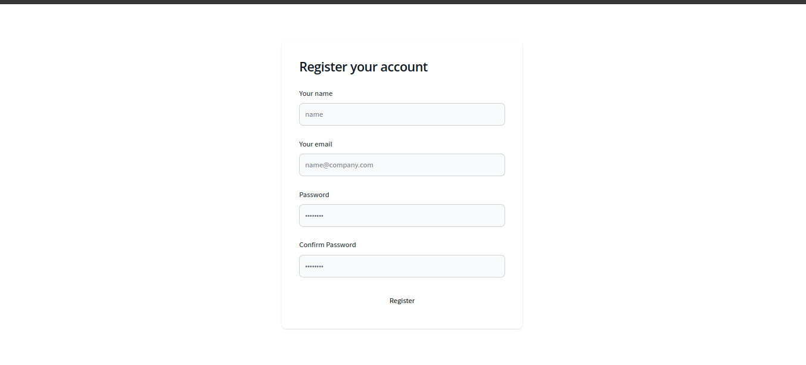
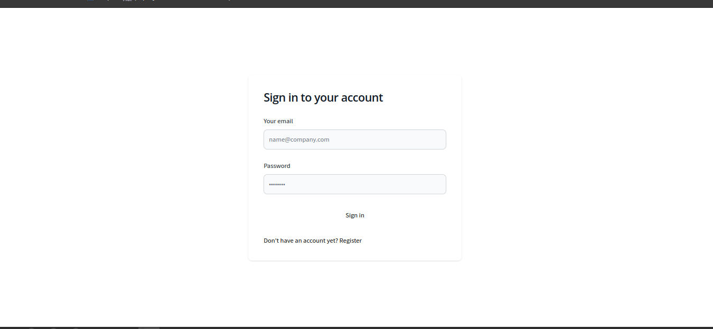
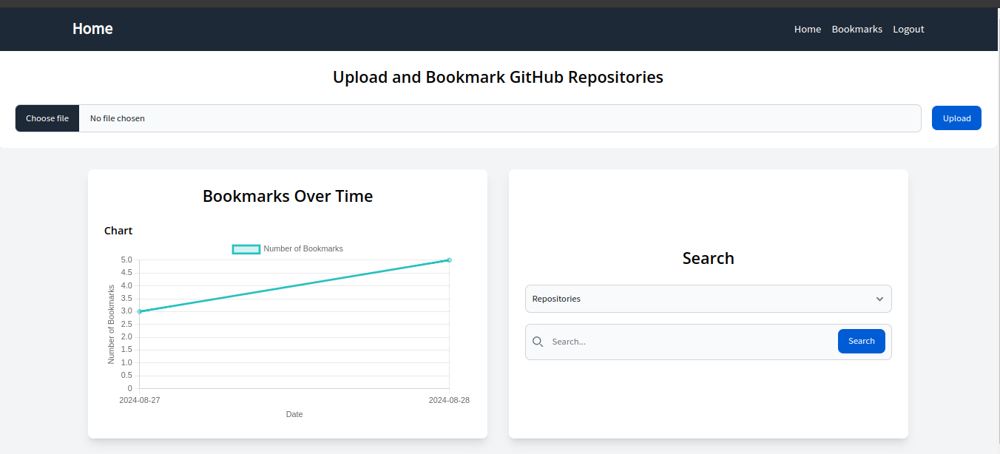
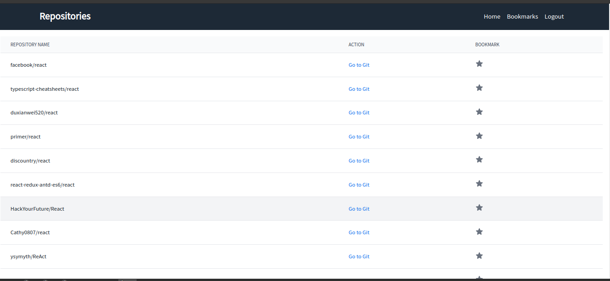
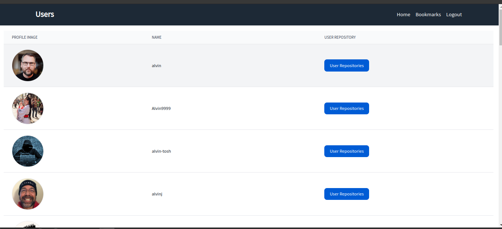
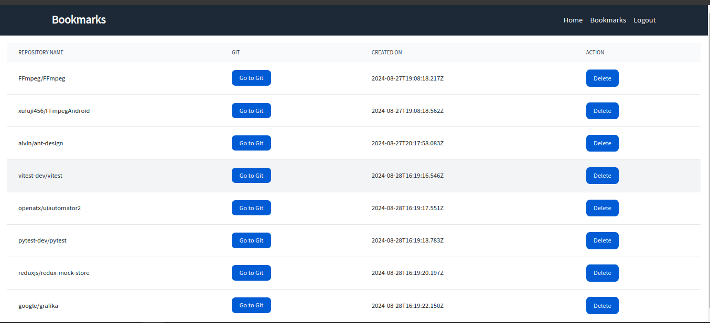

# Github

The application allows users to search for public repositories and users on GitHub, and bookmark repositories of interest. Users can view a list of their bookmarked repositories and see a chart displaying the count and dates of bookmarks made. Additionally, users have the option to upload a CSV file to bulk bookmark repositories. The project is developed using ReactJS for the frontend and NodeJS for the backend, with MongoDB as the database.

# Features

1. Includes an authentication system for user registration and login.
2. Features a dashboard where users can search for repositories or users, view a bookmark chart, and import bookmarks from a CSV file.
3. Allows users to list their bookmarked repositories and delete bookmarks as needed.

# How to run?

1. Install MongoDB by following the instructions here: https://www.mongodb.com/docs/manual/tutorial/install-mongodb-on-ubuntu/ .
2. Navigate to the project root directory in your terminal.
3. Run `cd server` and then `npm install` to install the server dependencies.
4. Start the server with `npm run start`.
5. Move to the frontend directory by running `cd web` and install the frontend dependencies with `npm install`.
6. Start the frontend development server with `npm run dev`.
7. Open your browser and go to http://localhost:5173/ to access the application.

Sample csv `repo.csv` attached on root directory.

# Screenshots

